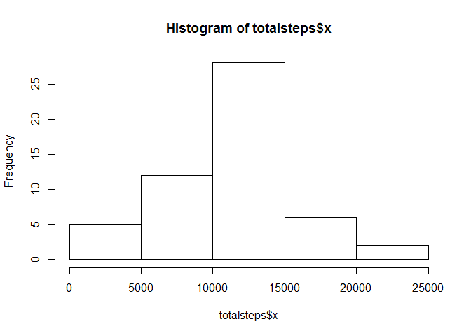
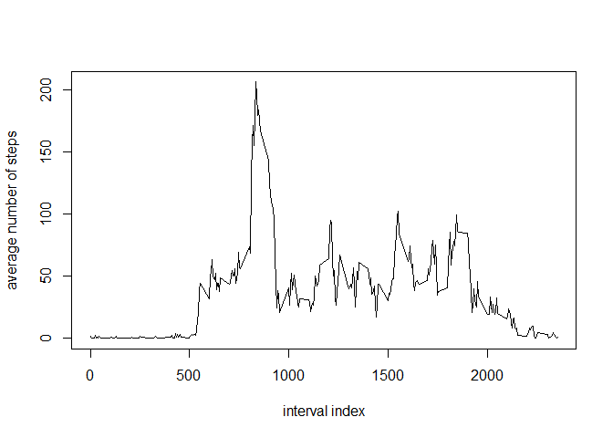
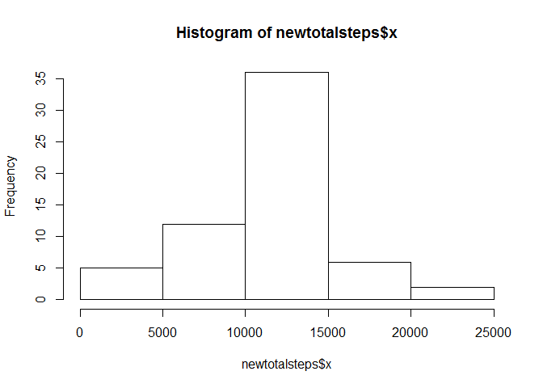
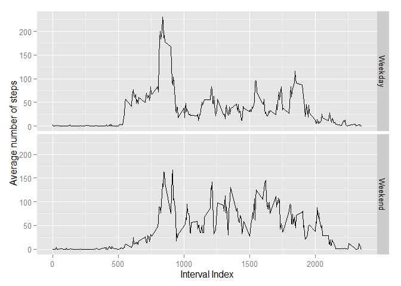

# Reproducible Research: Peer Assessment 1


## Loading and preprocessing the data

```r
rawdata <- read.csv("activity.csv",header=TRUE,na.strings="NA")
rawdata$date<-as.Date(rawdata$date,"%Y-%m-%d")
head(rawdata)
```

```
##   steps       date interval
## 1    NA 2012-10-01        0
## 2    NA 2012-10-01        5
## 3    NA 2012-10-01       10
## 4    NA 2012-10-01       15
## 5    NA 2012-10-01       20
## 6    NA 2012-10-01       25
```


## What is mean total number of steps taken per day?
### - Total number of steps

```r
filterNA <- rawdata[complete.cases(rawdata),]
totalsteps<-aggregate(filterNA$steps,list(filterNA$date),sum)
hist(totalsteps$x)
```

 

### - Mean of total number of steps taken per day:

```r
mean(totalsteps$x)
```

```
## [1] 10766.19
```

### - Median of total number of steps taken per day:

```r
median(totalsteps$x)
```

```
## [1] 10765
```


## What is the average daily activity pattern?

```r
avgsteps<-aggregate(filterNA$steps,list(filterNA$interval),mean)
plot(avgsteps$Group.1,avgsteps$x,type="l",xlab="interval index",ylab="average number of steps")
```

 

```r
maxInt <-avgsteps[order(avgsteps$x,decreasing=TRUE)[1],1]
```
Interval index 835 contains the maximum number of steps


## Imputing missing values

```r
narows <- nrow(rawdata[is.na(rawdata$steps),])
```
There are 2304 rows with NA.

To impute the missing values, replace NAs with the mean of the corresponding interval calculated for the other days.

```r
newset <- rawdata
newset[is.na(newset$steps),1] <- avgsteps[match(newset[is.na(newset$steps),3],avgsteps$Group.1),2]
newtotalsteps<-aggregate(newset$steps,list(newset$date),sum)
hist(newtotalsteps$x)
```

 
### - Mean of total number of steps taken per day:

```r
mean(newtotalsteps$x)
```

```
## [1] 10766.19
```

### - Median of total number of steps taken per day:

```r
median(newtotalsteps$x)
```

```
## [1] 10766.19
```

After imputing the missing values, the mean remains the same, whereas the median changes to the same value as the mean.
Imputing missing values using the average of other days increasing the central tendency, higher frequency for the 10000-15000 range.


## Are there differences in activity patterns between weekdays and weekends?

```r
weekset <- data.frame(newset,weekend=(weekdays(newset$date) %in% c("Saturday","Sunday")))
weekday <- weekset[weekset$weekend==FALSE,]
weekend <- weekset[weekset$weekend==TRUE,]
weekdaysteps<-data.frame(aggregate(weekday$steps,list(weekday$interval),mean),day=factor("Weekday"))
weekendsteps<-data.frame(aggregate(weekend$steps,list(weekend$interval),mean),day=factor("Weekend"))
weekavgsteps<-rbind(weekdaysteps,weekendsteps)

library(ggplot2)
g<-ggplot(weekavgsteps, aes(Group.1,x))+geom_line()+facet_grid(day~.)+labs(y="Average number of steps",x="Interval Index")
g
```

 
